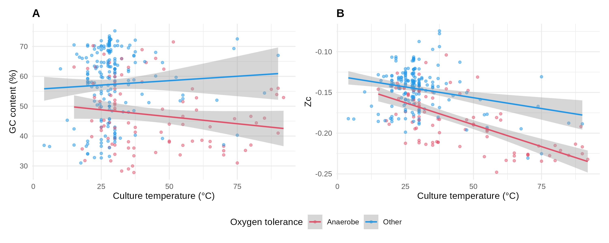

## BacDive analysis

We aim to disentangle the effects of different environmental and metabolic factors on **Carbon oxidation state** (Zc) of proteins in modern genomes.
[BacDive](https://bacdive.dsmz.de/)[^1] is a good data source for this.
It provides strain information, culture conditions, nutrition and environmental parameters, and links to genomic resources.
We run the analysis using both GC content (provided by BacDive) and Zc (computed from proteins in genomes).

### Data source

We used the BacDive website to search for entries that have values of **Culture temperature**, **Oxygen tolerance**, **Culture pH**, and **Nutrition type**
(use [this link](https://bacdive.dsmz.de/advsearch?fg%5B0%5D%5Bgc%5D=OR&fg%5B0%5D%5Bfl%5D%5B1%5D%5Bfd%5D=Temperature&fg%5B0%5D%5Bfl%5D%5B1%5D%5Bfo%5D=equal&fg%5B0%5D%5Bfl%5D%5B1%5D%5Bfv%5D=*&fg%5B0%5D%5Bfl%5D%5B1%5D%5Bfvd%5D=culture_temp-temp-3&fg%5B0%5D%5Bfl%5D%5B2%5D=AND&fg%5B0%5D%5Bfl%5D%5B3%5D%5Bfd%5D=Oxygen+tolerance&fg%5B0%5D%5Bfl%5D%5B3%5D%5Bfv%5D=*&fg%5B0%5D%5Bfl%5D%5B3%5D%5Bfvd%5D=oxygen_tolerance-oxygen_tol-4&fg%5B0%5D%5Bfl%5D%5B4%5D=AND&fg%5B0%5D%5Bfl%5D%5B5%5D%5Bfd%5D=pH&fg%5B0%5D%5Bfl%5D%5B5%5D%5Bfo%5D=equal&fg%5B0%5D%5Bfl%5D%5B5%5D%5Bfv%5D=*&fg%5B0%5D%5Bfl%5D%5B5%5D%5Bfvd%5D=culture_pH-pH-3&fg%5B0%5D%5Bfl%5D%5B6%5D=AND&fg%5B0%5D%5Bfl%5D%5B7%5D%5Bfd%5D=Nutrition+type&fg%5B0%5D%5Bfl%5D%5B7%5D%5Bfv%5D=*&fg%5B0%5D%5Bfl%5D%5B7%5D%5Bfvd%5D=nutrition_type-nutrition_type-4) to run the search).
This resulted in 384 hits.
We downloaded the results with the aforementioned variables as well as **GC content** and **genome accession numbers**.
This was saved in a file named [`custom_download_bacdive_2026-03-11.csv`](custom_download_bacdive_2026-03-11.csv).

### Data preprocessing

The downloaded data contain multiple entries for strains (e.g. with different experimental conditions).
However, inspecting the file reveals that only the first entry has complete data for all variables we are interested in.
Moreover, the file is not a plain CSV file but concatenates multiple blocks for strain data and references.
We directed [**Cursor**](https://cursor.com) to write a script to extract the first entry for each strain and to convert ranges to means.
For example, a value of Temperature listed as 15-42 is converted to 28.5.
The code is available in [`extract_data.R`](extract_data.R), and the cleaned data are saved in [`cleaned_data.csv`](cleaned_data.csv).

### Genomic data and Zc calculation

We used the INSDC accession number for genomes to download protein sequences.
The [`get_genomes.R`](get_genomes.R) script takes GCA numbers (i.e., archival records) from the BacDive data and downloads protein sequences
from corresponding GCF records (RefSeq with annotation) to zip files using the [NCBI datasets](https://www.ncbi.nlm.nih.gov/datasets/docs/v2/) tool.
Then, the script unzips and processes FASTA files to calculate mean Zc for all proteins in the genome,
and the results are saved to [`cleaned_data_with_Zc.csv`](cleaned_data_with_Zc.csv)

### Statistical analysis

#### Multiple regression

To test the strength of association of a continuous dependent variable (GC content) with multiple categorical and continuous predictors, we used multiple regression, also known as ordinary least squares (OLS).

GC content is a continuous compositional metric that measures the fraction of G and C bases in the genome sequence.
Temperature and pH are continuous predictors, but Oxygen tolerance and Nutrition type are categorical.
The categorical predictors are converted to **dummy variables**; for a categorical predictor with k levels, this creates k-1 binary columns, dropping one category as the reference group.
The R function **lm()** does this automatically.

We directed Cursor to write the analysis script; the resulting code is available in [`ols_bacdive.R`](ols_bacdive.R).
*Click the heading below to open the model summary.*

<details>
<summary><strong>GC content model</strong></summary>

```r
> summary(model)

Call:
lm(formula = `GC_content.GC-content` ~ culture_temp.Temperature + 
    culture_pH.pH + `oxygen_tolerance.Oxygen tolerance` + `nutrition_type.Nutrition type`, 
    data = df_model)

Residuals:
     Min       1Q   Median       3Q      Max 
-26.0186  -7.7942   0.2484   8.8835  21.9601 

Coefficients:
                                                           Estimate Std. Error t value Pr(>|t|)    
(Intercept)                                                74.55055    7.90728   9.428  < 2e-16 ***
culture_temp.Temperature                                    0.03956    0.04455   0.888  0.37526    
culture_pH.pH                                              -1.09557    0.51034  -2.147  0.03252 *  
`oxygen_tolerance.Oxygen tolerance`aerotolerant           -18.61655    8.36922  -2.224  0.02677 *  
`oxygen_tolerance.Oxygen tolerance`anaerobe               -14.45643    2.01630  -7.170 4.67e-12 ***
`oxygen_tolerance.Oxygen tolerance`facultative aerobe       3.51413    7.19761   0.488  0.62570    
`oxygen_tolerance.Oxygen tolerance`facultative anaerobe    -6.30281    2.03075  -3.104  0.00207 ** 
`oxygen_tolerance.Oxygen tolerance`microaerophile          -2.07526    3.57181  -0.581  0.56162    
`oxygen_tolerance.Oxygen tolerance`obligate aerobe         -2.68430    1.72727  -1.554  0.12109    
`oxygen_tolerance.Oxygen tolerance`obligate anaerobe      -17.11008    2.96922  -5.762 1.85e-08 ***
`nutrition_type.Nutrition type`chemoautolithotroph        -14.07806    8.44223  -1.668  0.09632 .  
`nutrition_type.Nutrition type`chemoautotroph              -2.41321   13.25069  -0.182  0.85560    
`nutrition_type.Nutrition type`chemoheterotroph            -9.73354    6.97957  -1.395  0.16405    
`nutrition_type.Nutrition type`chemolithoautotroph         -9.25104    7.01590  -1.319  0.18819    
`nutrition_type.Nutrition type`chemolithoheterotroph      -15.18727   11.09464  -1.369  0.17193    
`nutrition_type.Nutrition type`chemolithotroph            -19.52660    8.51614  -2.293  0.02246 *  
`nutrition_type.Nutrition type`chemoorganoheterotroph      -9.49427    6.93208  -1.370  0.17171    
`nutrition_type.Nutrition type`chemoorganotroph            -9.64520    6.82732  -1.413  0.15864    
`nutrition_type.Nutrition type`chemotroph                  -0.13871   13.18428  -0.011  0.99161    
`nutrition_type.Nutrition type`copiotroph|diazotroph       15.38564   13.16734   1.168  0.24343    
`nutrition_type.Nutrition type`diazotroph                   2.98630   10.98206   0.272  0.78584    
`nutrition_type.Nutrition type`heterotroph                -12.92143    6.92900  -1.865  0.06306 .  
`nutrition_type.Nutrition type`lithoautotroph               9.43774   13.16270   0.717  0.47386    
`nutrition_type.Nutrition type`lithoheterotroph             4.93777   10.61423   0.465  0.64208    
`nutrition_type.Nutrition type`lithotroph                  -0.56862   10.60323  -0.054  0.95726    
`nutrition_type.Nutrition type`methanotroph                -1.90907   10.50209  -0.182  0.85586    
`nutrition_type.Nutrition type`methylotroph                -2.63405    8.21157  -0.321  0.74858    
`nutrition_type.Nutrition type`mixotroph                   14.67685   13.02654   1.127  0.26066    
`nutrition_type.Nutrition type`oligotroph                   4.51388   13.17344   0.343  0.73207    
`nutrition_type.Nutrition type`organoheterotroph          -12.16709    7.81438  -1.557  0.12039    
`nutrition_type.Nutrition type`organotroph                -19.95429    7.80618  -2.556  0.01101 *  
`nutrition_type.Nutrition type`organotroph|photoautotroph  12.74133   13.33848   0.955  0.34014    
`nutrition_type.Nutrition type`photoheterotroph             3.46964    9.39687   0.369  0.71218    
`nutrition_type.Nutrition type`photoorganoheterotroph      -1.39298   13.56833  -0.103  0.91829    
---
Signif. codes:  0 ‘***’ 0.001 ‘**’ 0.01 ‘*’ 0.05 ‘.’ 0.1 ‘ ’ 1

Residual standard error: 11.25 on 342 degrees of freedom
Multiple R-squared:  0.2747,    Adjusted R-squared:  0.2047 
F-statistic: 3.925 on 33 and 342 DF,  p-value: 6.018e-11
```

</details>

*NOTE*: One level for each of Oxygen tolerance (`aerobe`) and Nutrition type (`autotroph`) is not listed in the summary because of the dummy encoding for categorical predictors.

We find that Oxygen tolerance has some of the lowest P-values.
However, we should not rely only on significance tests.

#### Effect size

A more revealing analysis would use the effect sizes of categorical predictors instead of the significance value of levels within each category.
To do this, we used the [**effectsize**](https://easystats.github.io/effectsize/) package[^2] to estimate how much variance in GC content is accounted for by each of the predictors.
These estimates are partial sums of squares and are applicable to both continuous and categorical predictors; we show bias-corrected estimates (ω²) below[^3].

```r
> library(effectsize)
> omega_squared(model, partial = TRUE)
# Effect Size for ANOVA (Type I)

Parameter                         | Omega2 (partial) |       95% CI
-------------------------------------------------------------------
culture_temp.Temperature          |             0.04 | [0.01, 1.00]
culture_pH.pH                     |         8.04e-03 | [0.00, 1.00]
oxygen_tolerance.Oxygen tolerance |             0.13 | [0.07, 1.00]
nutrition_type.Nutrition type     |             0.06 | [0.00, 1.00]

- One-sided CIs: upper bound fixed at [1.00].
```

Oxygen tolerance has the largest effect size, while the effect size for pH approaches zero.

#### Carbon oxidation state

Now we repeat the above analysis using Zc instead of GC content.
The modified script for the model is in [`ols_bacdive_Zc.R`](ols_bacdive_Zc.R).

<details>
<summary><strong>Zc model</strong></summary>

```r
> summary(model)

Call:
lm(formula = Zc ~ culture_temp.Temperature + culture_pH.pH + 
    `oxygen_tolerance.Oxygen tolerance` + `nutrition_type.Nutrition type`, 
    data = df_model)

Residuals:
      Min        1Q    Median        3Q       Max 
-0.059255 -0.014148  0.001276  0.010806  0.072642 

Coefficients:
                                                          Estimate Std. Error t value Pr(>|t|)    
(Intercept)                                             -0.1053423  0.0207542  -5.076 7.43e-07 ***
culture_temp.Temperature                                -0.0005542  0.0001085  -5.108 6.35e-07 ***
culture_pH.pH                                           -0.0006854  0.0012020  -0.570  0.56902    
`oxygen_tolerance.Oxygen tolerance`anaerobe             -0.0439887  0.0051520  -8.538 1.23e-15 ***
`oxygen_tolerance.Oxygen tolerance`facultative aerobe   -0.0007109  0.0239141  -0.030  0.97631    
`oxygen_tolerance.Oxygen tolerance`facultative anaerobe -0.0131647  0.0045594  -2.887  0.00422 ** 
`oxygen_tolerance.Oxygen tolerance`microaerophile       -0.0118981  0.0086092  -1.382  0.16817    
`oxygen_tolerance.Oxygen tolerance`obligate aerobe      -0.0076505  0.0042630  -1.795  0.07389 .  
`oxygen_tolerance.Oxygen tolerance`obligate anaerobe    -0.0422467  0.0079785  -5.295 2.56e-07 ***
`nutrition_type.Nutrition type`chemoautolithotroph      -0.0328827  0.0212389  -1.548  0.12280    
`nutrition_type.Nutrition type`chemoautotroph           -0.0081058  0.0301273  -0.269  0.78811    
`nutrition_type.Nutrition type`chemoheterotroph         -0.0146939  0.0187328  -0.784  0.43353    
`nutrition_type.Nutrition type`chemolithoautotroph      -0.0219674  0.0187742  -1.170  0.24305    
`nutrition_type.Nutrition type`chemolithoheterotroph    -0.0291928  0.0383378  -0.761  0.44708    
`nutrition_type.Nutrition type`chemolithotroph          -0.0436414  0.0212951  -2.049  0.04145 *  
`nutrition_type.Nutrition type`chemoorganoheterotroph   -0.0202625  0.0184568  -1.098  0.27331    
`nutrition_type.Nutrition type`chemoorganotroph         -0.0158051  0.0184510  -0.857  0.39247    
`nutrition_type.Nutrition type`chemotroph               -0.0024524  0.0302747  -0.081  0.93550    
`nutrition_type.Nutrition type`copiotroph|diazotroph     0.0309796  0.0301881   1.026  0.30576    
`nutrition_type.Nutrition type`diazotroph               -0.0087244  0.0309426  -0.282  0.77821    
`nutrition_type.Nutrition type`heterotroph              -0.0158891  0.0185697  -0.856  0.39299    
`nutrition_type.Nutrition type`lithoautotroph            0.0387331  0.0301767   1.284  0.20046    
`nutrition_type.Nutrition type`lithoheterotroph          0.0102255  0.0254556   0.402  0.68824    
`nutrition_type.Nutrition type`lithotroph               -0.0174754  0.0310888  -0.562  0.57453    
`nutrition_type.Nutrition type`methanotroph             -0.0132682  0.0249201  -0.532  0.59489    
`nutrition_type.Nutrition type`methylotroph             -0.0029287  0.0212508  -0.138  0.89050    
`nutrition_type.Nutrition type`oligotroph               -0.0181835  0.0299909  -0.606  0.54485    
`nutrition_type.Nutrition type`organoheterotroph        -0.0229821  0.0207211  -1.109  0.26842    
`nutrition_type.Nutrition type`organotroph              -0.0380232  0.0206507  -1.841  0.06674 .  
`nutrition_type.Nutrition type`photoheterotroph          0.0017391  0.0248889   0.070  0.94435    
---
Signif. codes:  0 ‘***’ 0.001 ‘**’ 0.01 ‘*’ 0.05 ‘.’ 0.1 ‘ ’ 1

Residual standard error: 0.02364 on 256 degrees of freedom
Multiple R-squared:  0.5372,    Adjusted R-squared:  0.4848 
F-statistic: 10.25 on 29 and 256 DF,  p-value: < 2.2e-16
```

</details>

```r
> library(effectsize)
> omega_squared(model, partial = TRUE)
# Effect Size for ANOVA (Type I)

Parameter                         | Omega2 (partial) |       95% CI
-------------------------------------------------------------------
culture_temp.Temperature          |             0.39 | [0.31, 1.00]
culture_pH.pH                     |             0.00 | [0.00, 1.00]
oxygen_tolerance.Oxygen tolerance |             0.22 | [0.14, 1.00]
nutrition_type.Nutrition type     |             0.03 | [0.00, 1.00]

- One-sided CIs: upper bound fixed at [1.00].
``` 

Note the lower P-value and higher effect size for **Culture temperature** in the Zc model than in the GC content model.

#### Visualization

[`GC_Zc_vs_T_O2.R`](GC_Zc_vs_T_O2.R) plots GC content and Zc (actual values, not predicted ones) against culture temperature, grouped by oxygen tolerance.
**Anaerobe** includes `anaerobe`, `facultative anaerobe`, or `obligate anaerobe`, and **Other** includes all other oxygen tolerance labels.
Linear fits with 95% confidence bands are shown.




### Takeaways

The statistical analysis demonstrates that:

- For both GC content and Zc, **Culture pH** has an effect size close to zero.
- For GC content, **Oxygen tolerance** has the largest effect size, followed by **Nutrition type**.
- For Zc, **Culture Temperature** has the largest effect size, followed by **Oxygen tolerance**.
- Multiple linear regression accounts for more of the variation of Zc than of GC content (indicated by higher R-squared for the former).

The visualization suggests the following:

- After controlling for temperature, GC content and Zc both tend to be lower in **Anaerobes**.
- After controlling for oxygen tolerance, Zc (but not GC content) tends to be lower for higher-temperature cultures.

[^1]: [BacDive in 2025: the core database for prokaryotic strain data](https://doi.org/10.1093/nar/gkae959)

[^2]: [effectsize: Estimation of Effect Size Indices and Standardized Parameters](https://doi.org/10.21105/joss.02815)

[^3]: We asked AI for advice on this.
*JMD*: For the purposes of assessing strength of association, how do I collapse the k−1 dummy variables into a single predictor variable for each starting categorical variable?
*Claude Sonnet 4.6*: You don't collapse the dummies into a single coefficient — instead you use metrics that summarize the **collective contribution** of all dummies for a given categorical variable.
**The Right Approach: Partial η² or Partial ω².** These measure how much variance in Y is uniquely explained by the categorical variable as a whole, analogous to an R² contribution for that variable.
**Partial η²** = SS_effect / (SS_effect + SS_residual).
**Partial ω²** is a bias-corrected version preferred for smaller samples — it's less inflated than η².

