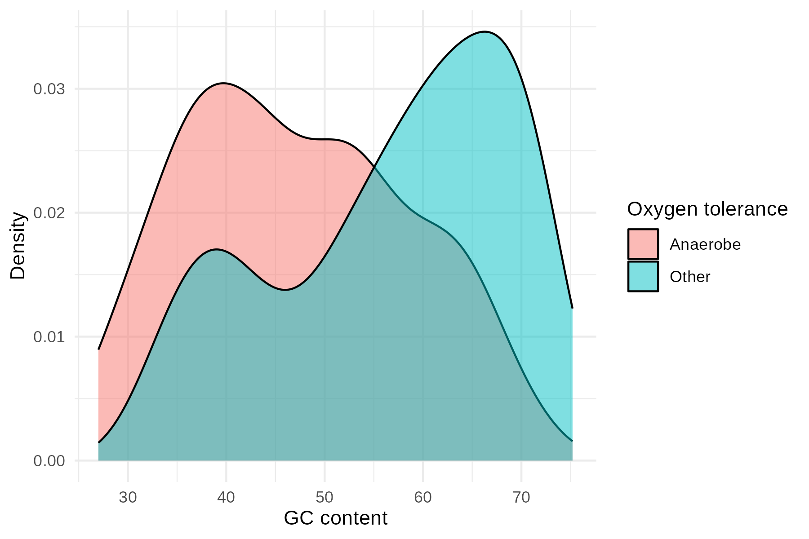

# genoGOE

This repository holds the code and data for "Evolutionary oxidation of proteins in Earth's history".

## BacDive analysis

We aim to disentangle the effects of different environmental and metabolic factors on **Carbon oxidation state** (Zc) of proteins in modern genomes.
[BacDive](https://bacdive.dsmz.de/)[^1] is a good data source for this.
It provides strain information, culture conditions, nutrition and environmental parameters, and links to genomic resources.

### Data source

We used the BacDive website to search for entries that have values of **Temperature**, **Oxygen tolerance**, **pH**, and **Nutrition type**
(use [this link](https://bacdive.dsmz.de/advsearch?fg%5B0%5D%5Bgc%5D=OR&fg%5B0%5D%5Bfl%5D%5B1%5D%5Bfd%5D=Temperature&fg%5B0%5D%5Bfl%5D%5B1%5D%5Bfo%5D=equal&fg%5B0%5D%5Bfl%5D%5B1%5D%5Bfv%5D=*&fg%5B0%5D%5Bfl%5D%5B1%5D%5Bfvd%5D=culture_temp-temp-3&fg%5B0%5D%5Bfl%5D%5B2%5D=AND&fg%5B0%5D%5Bfl%5D%5B3%5D%5Bfd%5D=Oxygen+tolerance&fg%5B0%5D%5Bfl%5D%5B3%5D%5Bfv%5D=*&fg%5B0%5D%5Bfl%5D%5B3%5D%5Bfvd%5D=oxygen_tolerance-oxygen_tol-4&fg%5B0%5D%5Bfl%5D%5B4%5D=AND&fg%5B0%5D%5Bfl%5D%5B5%5D%5Bfd%5D=pH&fg%5B0%5D%5Bfl%5D%5B5%5D%5Bfo%5D=equal&fg%5B0%5D%5Bfl%5D%5B5%5D%5Bfv%5D=*&fg%5B0%5D%5Bfl%5D%5B5%5D%5Bfvd%5D=culture_pH-pH-3&fg%5B0%5D%5Bfl%5D%5B6%5D=AND&fg%5B0%5D%5Bfl%5D%5B7%5D%5Bfd%5D=Nutrition+type&fg%5B0%5D%5Bfl%5D%5B7%5D%5Bfv%5D=*&fg%5B0%5D%5Bfl%5D%5B7%5D%5Bfvd%5D=nutrition_type-nutrition_type-4) to run the search).
This resulted in 384 hits.
We downloaded the results with the aforementioned variables as well as **GC content** and **genome accession numbers**.
This was saved in a file named [`custom_download_bacdive_2026-03-11.csv`](bacdive/custom_download_bacdive_2026-03-11.csv).

*NOTE*: We plan to calculate Zc through *in silico* translation of the genomes to protein sequences, but for now we use GC content to illustrate the approach.

### Data preprocessing

The downloaded data contain multiple entries for strains (e.g. with different experimental conditions).
However, inspecting the file reveals that only the first entry has complete data for all variables we are interested in.
Moreover, the file is not a plain CSV file but concatenates multiple blocks for strain data and references.
We directed [**Cursor**](https://cursor.com) to write a script to extract the first entry for each strain.
The code is available in [`extract_data.R`](bacdive/extract_data.R), and the cleaned data are saved in [`cleaned_data.csv`](bacdive/cleaned_data.csv).

### Statistical analysis

#### Multiple regression

To test the strength of association of a continuous dependent variable (GC content) with multiple categorical and continuous predictors, we used multiple regression, also known as ordinary least squares (OLS).

GC content is a continuous compositional metric that measures the fraction of G and C bases in the genome sequence.
Temperature and pH are continuous predictors, but Oxygen tolerance and Nutrition type are categorical.
The continuous predictors are converted to **dummy variables**; for a categorical predictor with k levels, this creates k-1 binary columns, dropping one category as the reference group.
The R function **lm()** does this automatically.

We directed Cursor to write the analysis script.
In particular, we asked for ranges to be converted to means.
For example, a value of Temperature entered as 14-42 was treated as 28.
The resulting code is available in [`ols_bacdive.R`](bacdive/ols_bacdive.R):

The summary of the resulting model fit is listed below.

*NOTE*: One level each for Oxygen tolerance (`aerobe`) and Nutrition type (`autotroph`) are not listed because of the dummy encoding for categorical predictors.

```r
> summary(model)

Call:
lm(formula = `GC_content.GC-content` ~ culture_temp.Temperature + 
    culture_pH.pH + `oxygen_tolerance.Oxygen tolerance` + `nutrition_type.Nutrition type`, 
    data = df_model)

Residuals:
     Min       1Q   Median       3Q      Max 
-26.0186  -7.7942   0.2484   8.8835  21.9601 

Coefficients:
                                                           Estimate Std. Error t value Pr(>|t|)    
(Intercept)                                                74.55055    7.90728   9.428  < 2e-16 ***
culture_temp.Temperature                                    0.03956    0.04455   0.888  0.37526    
culture_pH.pH                                              -1.09557    0.51034  -2.147  0.03252 *  
`oxygen_tolerance.Oxygen tolerance`aerotolerant           -18.61655    8.36922  -2.224  0.02677 *  
`oxygen_tolerance.Oxygen tolerance`anaerobe               -14.45643    2.01630  -7.170 4.67e-12 ***
`oxygen_tolerance.Oxygen tolerance`facultative aerobe       3.51413    7.19761   0.488  0.62570    
`oxygen_tolerance.Oxygen tolerance`facultative anaerobe    -6.30281    2.03075  -3.104  0.00207 ** 
`oxygen_tolerance.Oxygen tolerance`microaerophile          -2.07526    3.57181  -0.581  0.56162    
`oxygen_tolerance.Oxygen tolerance`obligate aerobe         -2.68430    1.72727  -1.554  0.12109    
`oxygen_tolerance.Oxygen tolerance`obligate anaerobe      -17.11008    2.96922  -5.762 1.85e-08 ***
`nutrition_type.Nutrition type`chemoautolithotroph        -14.07806    8.44223  -1.668  0.09632 .  
`nutrition_type.Nutrition type`chemoautotroph              -2.41321   13.25069  -0.182  0.85560    
`nutrition_type.Nutrition type`chemoheterotroph            -9.73354    6.97957  -1.395  0.16405    
`nutrition_type.Nutrition type`chemolithoautotroph         -9.25104    7.01590  -1.319  0.18819    
`nutrition_type.Nutrition type`chemolithoheterotroph      -15.18727   11.09464  -1.369  0.17193    
`nutrition_type.Nutrition type`chemolithotroph            -19.52660    8.51614  -2.293  0.02246 *  
`nutrition_type.Nutrition type`chemoorganoheterotroph      -9.49427    6.93208  -1.370  0.17171    
`nutrition_type.Nutrition type`chemoorganotroph            -9.64520    6.82732  -1.413  0.15864    
`nutrition_type.Nutrition type`chemotroph                  -0.13871   13.18428  -0.011  0.99161    
`nutrition_type.Nutrition type`copiotroph|diazotroph       15.38564   13.16734   1.168  0.24343    
`nutrition_type.Nutrition type`diazotroph                   2.98630   10.98206   0.272  0.78584    
`nutrition_type.Nutrition type`heterotroph                -12.92143    6.92900  -1.865  0.06306 .  
`nutrition_type.Nutrition type`lithoautotroph               9.43774   13.16270   0.717  0.47386    
`nutrition_type.Nutrition type`lithoheterotroph             4.93777   10.61423   0.465  0.64208    
`nutrition_type.Nutrition type`lithotroph                  -0.56862   10.60323  -0.054  0.95726    
`nutrition_type.Nutrition type`methanotroph                -1.90907   10.50209  -0.182  0.85586    
`nutrition_type.Nutrition type`methylotroph                -2.63405    8.21157  -0.321  0.74858    
`nutrition_type.Nutrition type`mixotroph                   14.67685   13.02654   1.127  0.26066    
`nutrition_type.Nutrition type`oligotroph                   4.51388   13.17344   0.343  0.73207    
`nutrition_type.Nutrition type`organoheterotroph          -12.16709    7.81438  -1.557  0.12039    
`nutrition_type.Nutrition type`organotroph                -19.95429    7.80618  -2.556  0.01101 *  
`nutrition_type.Nutrition type`organotroph|photoautotroph  12.74133   13.33848   0.955  0.34014    
`nutrition_type.Nutrition type`photoheterotroph             3.46964    9.39687   0.369  0.71218    
`nutrition_type.Nutrition type`photoorganoheterotroph      -1.39298   13.56833  -0.103  0.91829    
---
Signif. codes:  0 ‘***’ 0.001 ‘**’ 0.01 ‘*’ 0.05 ‘.’ 0.1 ‘ ’ 1

Residual standard error: 11.25 on 342 degrees of freedom
Multiple R-squared:  0.2747,    Adjusted R-squared:  0.2047 
F-statistic: 3.925 on 33 and 342 DF,  p-value: 6.018e-11
```

We find that Oxygen tolerance has some of the lowest P-values.
However, we should not rely only on significance tests.

#### Effect size

A more revealing analysis would compare the effect sizes of categorical predictors instead of the significance value of levels within each category.
To do this, we used the [**effectsize**](https://easystats.github.io/effectsize/) package[^2] to estimate how much variance in GC content is accounted for by each of the predictors.
These estimates are partial sums of squares and are applicable to both continuous and categorical predictors[^3].

Here are the results for effect size (η²) and a bias-corrected estimate (ω²):

```r
> library(effectsize)

> eta_squared(model, partial = TRUE)
# Effect Size for ANOVA (Type I)

Parameter                         | Eta2 (partial) |       95% CI
-----------------------------------------------------------------
culture_temp.Temperature          |           0.04 | [0.01, 1.00]
culture_pH.pH                     |           0.01 | [0.00, 1.00]
oxygen_tolerance.Oxygen tolerance |           0.16 | [0.09, 1.00]
nutrition_type.Nutrition type     |           0.12 | [0.02, 1.00]

- One-sided CIs: upper bound fixed at [1.00].

> omega_squared(model, partial = TRUE)
# Effect Size for ANOVA (Type I)

Parameter                         | Omega2 (partial) |       95% CI
-------------------------------------------------------------------
culture_temp.Temperature          |             0.04 | [0.01, 1.00]
culture_pH.pH                     |         8.04e-03 | [0.00, 1.00]
oxygen_tolerance.Oxygen tolerance |             0.13 | [0.07, 1.00]
nutrition_type.Nutrition type     |             0.06 | [0.00, 1.00]

- One-sided CIs: upper bound fixed at [1.00].
```

The largest effect sizes are for Oxygen tolerance.

#### Visualization

This shows the distribution of GC content (actual values, not predicted ones) in two groups:
strains listed as `anaerobe`, `facultative anaerobe`, or `obligate anaerobe` (red), and all others (blue).

```r
# Add a column to the data frame created by `ols_bacdive.R`
is_anaerobe <- grepl("anaerobe", df$`oxygen_tolerance.Oxygen tolerance`)
df$`Oxygen tolerance` <- ifelse(is_anaerobe, "Anaerobe", "Other")

# Create density plot
ggplot(df, aes(x = `GC_content.GC-content`, fill = `Oxygen tolerance`)) +
  geom_density(alpha = 0.5) +
  theme_minimal() +
  labs(x = "GC content", y = "Density")

ggsave("GC_content.png", width = 6, height = 4)
```



### Takeaways

- **Oxygen tolerance** emerges as the predictor that has the largest effect size, especially in the bias-corrected estimate.
- Anaerobes tend to have lower GC content.
- The low R-squared value means that a lot of variation in GC content is not accounted for by the model.

What would happen if we looked at Zc instead?

[^1]: [BacDive in 2025: the core database for prokaryotic strain data](https://doi.org/10.1093/nar/gkae959)

[^2]: [effectsize: Estimation of Effect Size Indices and Standardized Parameters](https://doi.org/10.21105/joss.02815)

[^3]: We asked AI for advice on this.
*JMD*: For the purposes of assessing strength of association, how do I collapse the k−1 dummy variables into a single predictor variable for each starting categorical variable?
*Claude Sonnet 4.6*: You don't collapse the dummies into a single coefficient — instead you use metrics that summarize the **collective contribution** of all dummies for a given categorical variable.
**The Right Approach: Partial η² or Partial ω².** These measure how much variance in Y is uniquely explained by the categorical variable as a whole, analogous to an R² contribution for that variable.
**Partial η²** = SS_effect / (SS_effect + SS_residual).
**Partial ω²** is a bias-corrected version preferred for smaller samples — it's less inflated than η².

